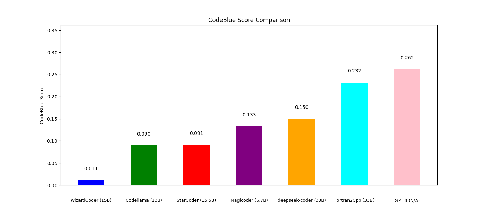

# Fortran2Cpp

## Introduction
Fortran has been a widely used programming language for scientific computation since 1957. With technological advancements, modern languages like C++ have become preferable for some projects due to their greater flexibility and features. However, the lack of an accurate and comprehensive Fortran-to-C++ translation dataset means that existing large models, including GPT-4, often struggle to perform this task effectively, resulting in translations that may fail to compile or pass unit tests. Fortran2Cpp aims to address this issue.

## Model

We fine-tuned several popular pre-trained models,  including 
* WizardCoder-15B-V1.0,
* CodeLlama-13b-Instruct-hf,
* starcoder,
* starcoder2,
* Magicoder-S-DS-6.7B, and
* deepseek-coder-33b-instruct. 

After the fine-tuning, the deepseek-coder-33b-instruct shows the greatest improvement when checking with the CodeBLEU Score. Thus we finally use the deepseek-coder-33b-instruct as the backbone of Fortran2CPP.  

The Model is available on Hugging Face: [Fortran2Cpp](https://huggingface.co/Bin12345/Fortran2Cpp) 

**NOTE:** Currently, the model is trained by using a dataset with paired Fortran (f90) and C++ code. We are still training the model. We will continue to update the Fortran2Cpp.

## Evaluation
We compared with various models (WizardCoder-15B-V1.0, CodeLlama-13b-Instruct-hf, starcoder, Magicoder-S-DS-6.7B, deepseek-coder-33b-instruct and GPT-4) on [HPC_Fortran_CPP](https://huggingface.co/datasets/Bin12345/HPC_Fortran_CPP). And compared the CodeBLEU Score of the generated results.

The CodeBLEU Score Comparison is shown in the figure below:



### Reproduce Steps

We recommend using virtual environment to set up the python environments and install required packages:

```
python3.9 -m venv .venv
source .venv/bin/activate
pip install -r requirements.txt

pip install -r requirements.txt
```

1. Enter into Evaluation folder

```
cd Evaluation
```

2. To generate the results. Go the script `text_generation_pipline.py`. 

You can modify things like
* the model that you want to test: defined between line 9 and line 14.
* the file path where you want to store your results: defined in line 59, default is log.txt . 

Run:
```
export HUGGINGFACE_TOKEN="your_access_token_here"
python text_generation_pipline.py


# sample output of the text generation pipeline:

input_prompt: 
Translate this Fortran code to C++: 
program DRB096_doall2_taskloop_collapse_orig_no\n    use omp_lib\n    use DRB096\n    implicit none\n\n    integer :: len, i, j\n    len = 100\n\n    allocate (a(len,len))\n\n    !$omp parallel\n        !$omp single\n            !$omp taskloop collapse(2)\n            do i = 1, len\n                do j = 1, len\n                    a(i,j) = a(i,j)+1\n                end do\n            end do\n            !$omp end taskloop\n        !$omp end single\n    !$omp end parallel\n\n    print 100, a(50,50)\n    100 format ('a(50,50) =',i3)\n\nend program
#1 Fortran Code has been translated. 
Translated C++ Code:
 DRB096_doall2_taskloop_collapse_orig_no

#include <omp.h>
#include <iostream>

int main() {
    int len = 100;
    double **a = new double*[len];
    for (int i = 0; i < len; ++i) {
        a[i] = new double[len];
    }

    #pragma omp parallel
    {
        #pragma omp single
        {
            #pragma omp taskloop collapse(2)
            for (int i = 1; i <= len; ++i) {
                for (int j = 1; j <= len; ++j) {
                    a[i-1][j-1] += 1;
                }
            }
        }
    }

    std::cout << "a(50,50) = " << a[49][49] << std::endl;

    for (int i = 0; i < len; ++i) {
        delete[] a[i];
    }
    delete[] a;

    return 0;
}

This C++ code does the same thing as the Fortran code. It allocates a 2D array `a`, then uses OpenMP to parallelize the task of incrementing each element of `a`. The `collapse(2)` clause is used to collapse the two loops into a single loop, which is then parallelized by OpenMP. The result is printed to the console.
```

This will generate the results and compress each result to one line for the further CodeBLEU Score test.

This script does the following
* model: Bin12345/F2C-Translator // configurable to use any other models
* dataset: Bin12345/HPC_Fortran_CPP
* Translate Fortran Code in the dataset to C++ code
* Write to a log

3. Test CodeBLEU Score by using the following command

```
cd CodeBLEU
python calc_code_bleu.py --refs Fortran2Cpp/Evaluation/Groundtruth_C++.txt --hyp <path/to/your/results/txt/file> --lang cpp --params 0.25,0.25,0.25,0.25
```

* Run inference on Slurm Cluster: Your should use this script to start the inference: `sbatch <The/following/script>`

```
#!/bin/bash
#SBATCH -N 1
#SBATCH -C gpu&hbm80g
#SBATCH -G 4
#SBATCH -q regular
#SBATCH -J model_training
#SBATCH --mail-user=<Your/Email>
#SBATCH --mail-type=ALL
#SBATCH -t 00:30:00
#SBATCH -A <Your/Project>

# Load conda  
echo "loading conda..."
module load conda 
conda activate <Your/Conda/env>

# Huggingface Setting 
echo "Setting Huggingface..."
export HF_HOME=$SCRATCH/huggingface 
export HF_TOKEN=<Your/HF/ToKen>

# OpenMP settings:
echo "Setting OMP..."
export OMP_NUM_THREADS=1
export OMP_PLACES=threads
export OMP_PROC_BIND=spread

# Set CFLAGS and LDFLAGS and CUTLASS 
export CFLAGS="-I/<Your/Conda/env>/include $CFLAGS"
export LDFLAGS="-L/<Your/Conda/env>/lib $LDFLAGS"
export CUTLASS_PATH=$HOME/cutlass

# run the application:
echo "Start to run the inference..."
chmod +x <Your/inference/file/path>
srun -n 1 -c 8 --cpu_bind=cores -G 4 --gpu-bind=none  <Your/inference/file/path> > <Your/log/file/path> 2>&1 
```

## Dataset Generation 

1. Setup your OpenAI Key.
```
cd dataset_generation
export export OPENAI_API_KEY="sk...."
```

Modify engine_F2C.py to customize the input dataset range, teacher model ID, output folder, etc.
Default values are the following:
```
if __name__ == "__main__":
    key = get_openai_api_key() # Obtain your OpenAI Key from an environment variable named OPENAI_API_KEY

    # You can also use other datasets
    Fortran_dataset = load_dataset("codeparrot/github-code", "FORTRAN-all")
    data = Fortran_dataset["train"][78000:85000]

    output_file = "" # Output Json file
    generate_data(key, data, output_file, gpt_model="gpt-4o") # Need to change
```

2. Start the dataset generation

```
python engine_F2C.py
```

The dataset that we used is included in `F2C-Translator/data/F2C_dialogue_25K.json` file.

## Inference and Demo
The demo code is modified from [OpenCodeInterpreter](https://github.com/OpenCodeInterpreter/OpenCodeInterpreter/tree/main/demo). Appreciate for their great project!

1. Create conda and install packages
```
cd Web_demo
conda create -n demo python=3.10
conda activate demo
pip install -r requirements.txt
```

2.  Start the demo
```
python chatbot.py
```

**NOTE:** This demo will not use the interpreter function. This feature is a potential extension for this work.

## Hardware requirements

We used 6 A100 GPUs with 80GB memory for the training.  (Use Lora)

We used 2 A100 GPUs with 80GB memory for the inference. 

## Contact 
If you have any inquiries, please feel free to raise an issue or reach out to leib2765@gmail.com.

## Citation
We will complete the technical introduction paper before mid-May.

## Known Issues

https://huggingface.co/datasets/Bin12345/HPC_Fortran_CPP seems to have 315 rows of data. However, Groundtruth_C++.txt has only 296 rows.  The reason is that we filtered some long data samples. 

## Acknowledgments
Appreciation to Lawrence Livermore National Laboratory (Technical Contact: liao6@llnl.gov) for their financial support of this project.
